## Advanced Lane Finding
[](http://www.udacity.com/drive)

The goals / steps of this project are the following:

* Compute the camera calibration matrix and distortion coefficients given a set of chessboard images.
* Apply a distortion correction to raw images.
* Apply a perspective transform to warp images ("birds-eye view").
* Use color transforms, gradients, etc., to create a thresholded binary image.
* Detect lane pixels and fit to find the lane boundary.
* Determine the curvature of the lane and vehicle position with respect to center.
* Warp the detected lane boundaries back onto the original image.
* Output visual display of the lane boundaries and numerical estimation of lane curvature and vehicle position.

## [Rubric](https://review.udacity.com/#!/rubrics/571/view) Points

### Here I will consider the rubric points individually and describe how I addressed each point in my implementation.  

---

### Writeup / README

#### 1. Provide a Writeup / README that includes all the rubric points and how you addressed each one.

This writeup addresses all of the rubric points for the project.  All of the code referenced in this report is in the file [`main.py`](./main.py), and all other generated materials can be found in the GitHub repo.

### Camera Calibration

#### 1. Briefly state how you computed the camera matrix and distortion coefficients. Provide an example of a distortion corrected calibration image.

The code for camera calibration is located in `main.py` on lines 8-42.  The function `calibrate_camera()` returns the camera matrix `mtx` and distortion coefficients `dist`.  The function looks for a folder `camera_cal` containing images of a chessboard with 9x6 interior points.

The function relies on `cv2.calibrateCamera` to calculate the camera matrix and distortion coefficients.  This function compares known "object points" with corresponding "image points" that have been found in the image.  In this case, the points refer to the interior points on an 8x6 chessboard.

The first step of the function is to define the object points which represent the locations of chessboard points in a 2-D plane.  The values for these points are simply a mesh grid.  Then, the grayscale of each image is scanned for the image points using the function `cv2.findChessboardCorners`. Lastly, the function returns the results of `cv2.calibrateCamera` using the object points and image points.

Once `mtx` and `dist` are calculated, `cv2.undistort` can be used in the pipeline to remove the distortions from the image

  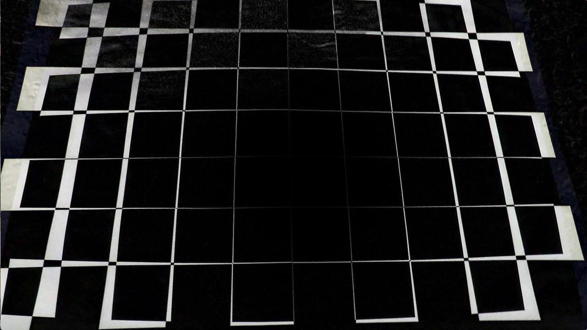

**Figure 1**: from left to right, calibration image, undistorted image, absolute difference between images

Note: In order to calculate the camera matrix and distortion coefficients, `main.py` must be called with the option `--calibrate_camera true`.  Otherwise, a pickle file is loaded containing pre-calculated values.

---

### Pipeline (single images)

#### 1. Provide an example of a distortion-corrected image.

The image pipeline corrects the image distortion with the following line:

```python
341:  undist = cv2.undistort(image, mtx, dist, None, mtx)
```

`image` is the input to the pipeline (converted to RGB). `mtx` and `dist` are defined at the `__main__` scope in the module; either from a loaded pickle file or the `calibrate_camera` function.


**Figure 2**: Distortion corrected test image

#### 2. Describe how (and identify where in your code) you performed a perspective transform and provide an example of a transformed image.

The image pipeline transforms the image with the following line:

```python
344:  warped_color = cv2.warpPerspective(undist, M, img_size)
```

I chose to transform the RGB image rather than the binary image because I found thresholding to be more effective from the birds-eye view.  

`M` and `img_size` are both defined at the `__main__` scope (375-388). `M` is the perspective transform, calculated by the line:

```python
387:  M = cv2.getPerspectiveTransform(src_pts, dst_pts)
```

`src_pts` and `dst_pts` are the corner points that define the transformation.  The points are hardcoded and hand-picked to perfectly transform straight lanes to vertical, parallel lines. `img_size` is also hardcoded as `(1280, 720)`

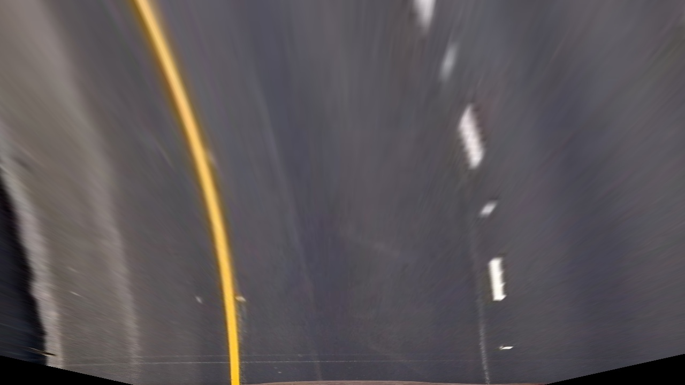

**Figure 3**: Warped test image

#### 3. Describe how (and identify where in your code) you used color transforms, gradients or other methods to create a thresholded binary image.  Provide an example of a binary image result.

The function that creates a threshold of the image is called from the image pipeline with the following line:

```python
347:  warped_bin = color_threshold(warped_color)
```

A color threshold was more than sufficient to identify the lanes without the need to run costly convolutions to calculate the gradients.  The function `color_threshold` calls two other functions--`white_threshold` and `yellow_threshold`--and combines the results (lines 139-172).

`white_threshold` identifies the white lines in the image using a simple threshold for lightness (via HLS color space).  However, `yellow_threshold` detects the yellow lanes by only finding pixels in fine-tuned ranges for the red, blue, hue, lightness, and saturation channels.

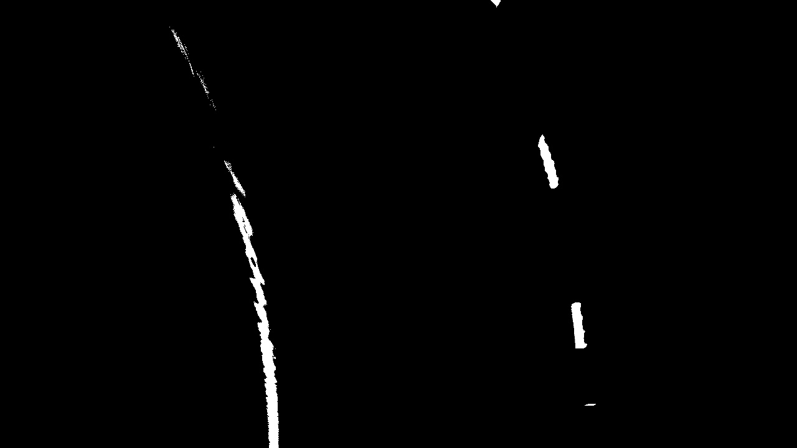

**Figure 4**: Binary test image

#### 4. Describe how (and identify where in your code) you identified lane-line pixels and fit their positions with a polynomial?

The lane lines are identified using the Sliding Windows Search outlined during the lessons.  A function that performs this search is called from the following line in the image pipeline:

```python
350: lane_area, lane_lines, radius, position = sliding_windows(warped_bin)
```

The function (lines 189-303) first calculates a histogram along the columns on the lower half of the binary image.  It finds the highest peak on each side of the image.  Using these points to start the search for the lanes, the algorithm starts counting pixels from the bottom of the image.  Only points within a certain margin from the lane are counted, and the center of the search is periodically updated to follow the detected lane lines.

After all of the lane pixels are detected, a second order polynomial is fit to each lane.  This allows the area between the lanes to be drawn onto an image for visualization.

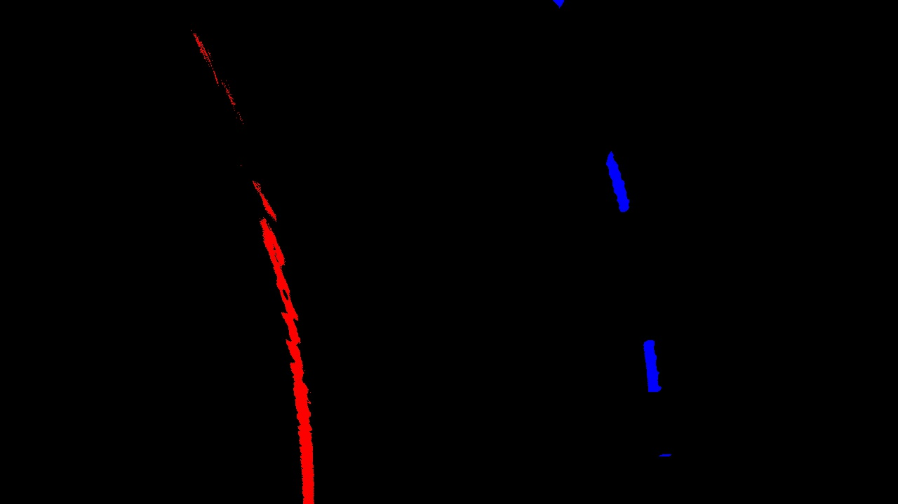 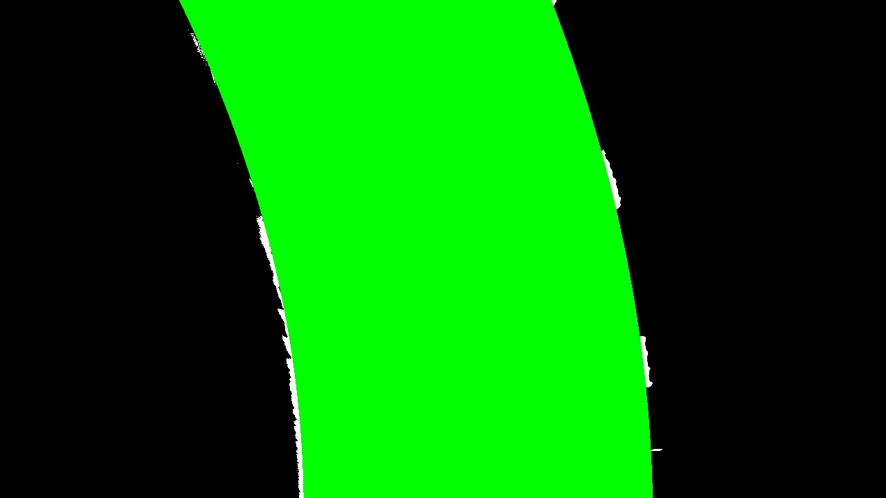

**Figure 5**: Line lines (left), lane area (right)


#### 5. Describe how (and identify where in your code) you calculated the radius of curvature of the lane and the position of the vehicle with respect to center.

The radius of curvature of the road and the position of the car are also calculated in the `sliding_windows` function (lines 189-303).  However, these require new polynomial fits defined in meters, rather than pixels.  The following suggested values for conversion factors were used:

```python
ym_per_pix = 30/720 # meters per pixel in y dimension
xm_per_pix = 3.7/700 # meters per pixel in x dimension
```

Using the new second order polynomials, the radius of curvature can be calculated using the equation below:

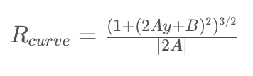

**Equation 1**: Radius of curvature for *f(y)=Ay<sup>2</sup>+By+c*

The *y* value used in the equation is the value at the bottom of the image, which represents the location of the car.  The radii returned by the function is the average between the two lanes.

The center of the lane is defined to be the center point between the lanes at the bottom of the image.  This can be calculated in meters using the equation for a second order polynomial for each lane, then averaging the results.  Because the car is assumed to be in the center of the image, the difference between the center of the image and center of the lane can be calculated to find the position of the car.

#### 6. Provide an example image of your result plotted back down onto the road such that the lane area is identified clearly.

The results from `sliding_windows` and the undistorted image are passed to the following function to produce the final image:

```python
354:  final = draw_lane_area(lane_area, lane_lines, undist, radius, position)
```

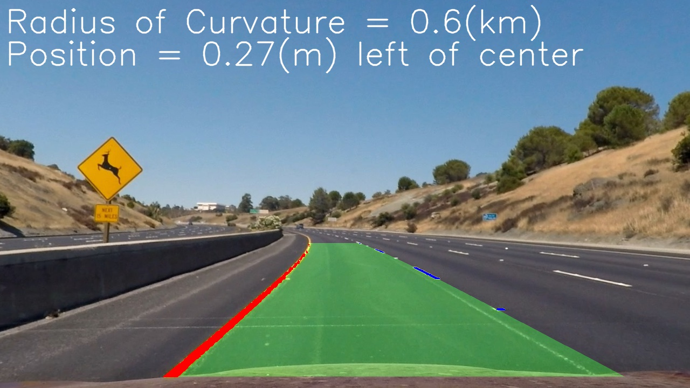

**Figure 6**: Final output image

---

### Pipeline (video)

#### 1. Provide a link to your final video output.  Your pipeline should perform reasonably well on the entire project video (wobbly lines are ok but no catastrophic failures that would cause the car to drive off the road!).


<u>**[project_video_output.mp4](./project_video_output.mp4)**</u>

---

### Discussion

#### 1. Briefly discuss any problems / issues you faced in your implementation of this project.  Where will your pipeline likely fail?  What could you do to make it more robust?

The most challenging aspect of this image was correctly identifying the yellow lane on light pavement, as in the figure below.  The function `yellow_threshold` includes finely-tuned thresholds because the line and pavement are very similar in all of the channels.  The only way to eliminate the false positives was to have very tight ranges.  Unfortunately, this reduces the number of yellow line pixels in most frames.  To compensate, the polyfit of the last 10 frames is averaged for the video pipeline.

 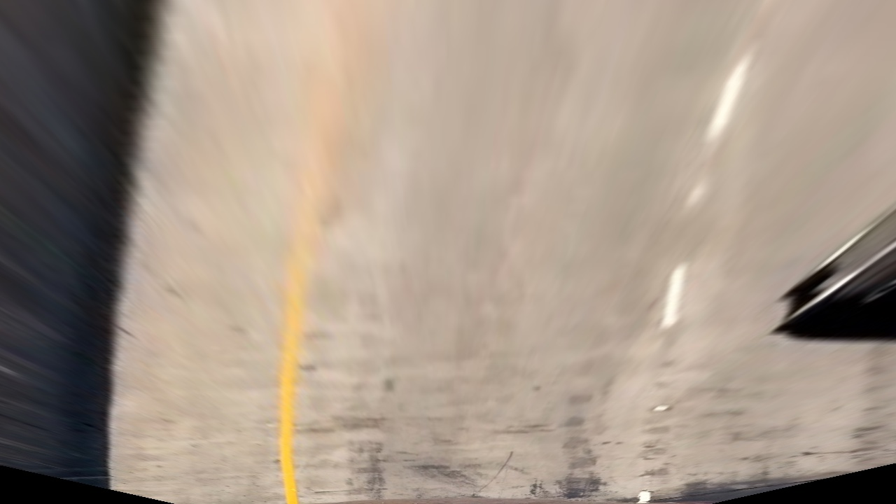
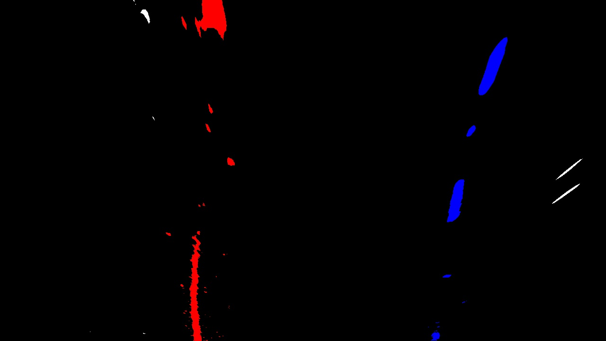 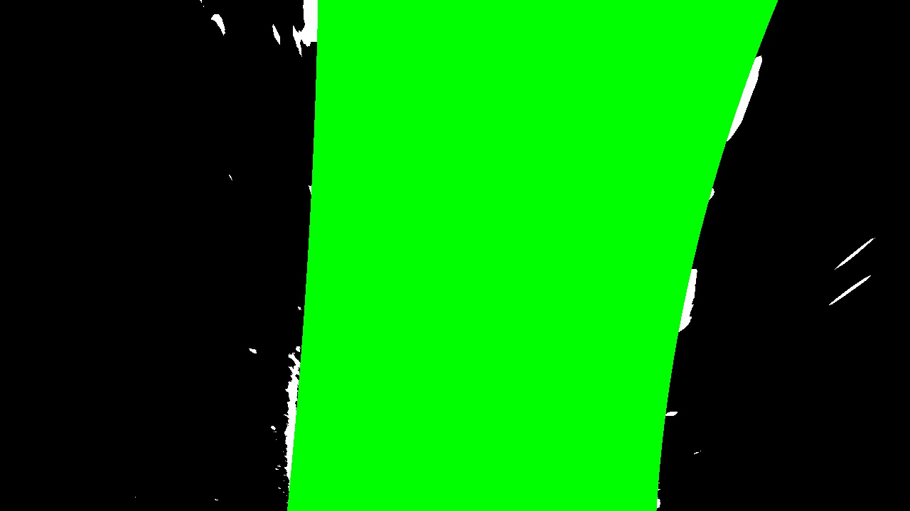
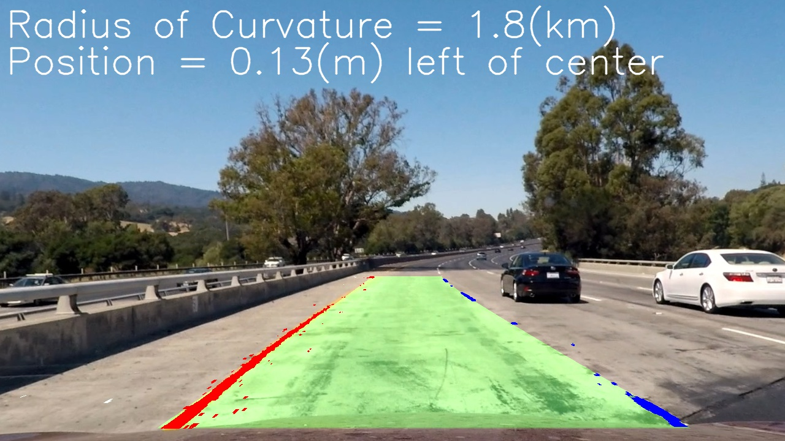

**Figure 7**: Pipeline stages for problem image

Additionally, because the color thresholding function was fine-tuned for the main project video, it fails completely on the challenge videos.  To increase the robustness of the thresholding function, it may be beneficial to apply additional pre-processing such as histogram equalization to increase the contrast in the image, making gradient thresholding easier.

I didn't use gradient thresholding in the final version of this project because (a) there are more parameters to fine-tune, and (b) they only detected the edges of the lane marking, rather than the pixels on the lane line themselves.  The convolution used in the thresholding also greatly slowed down the pipeline.

Another beneficial change to the video pipeline would be to restrict the search for lane pixels to specific regions of interest detected in previous frames.  Using this technique would speed up the code, and may also be more resilient to difficult frames.
